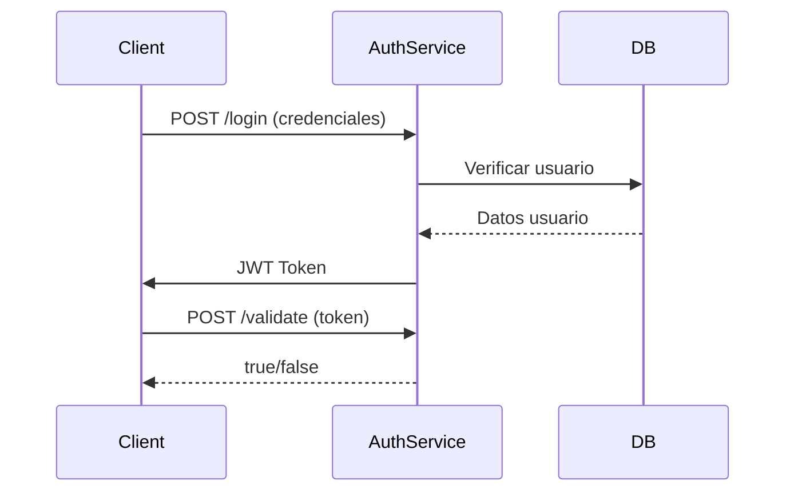

# Segundo Reto - Sistema de Control de Acceso Peatonal

## AuthService - Microservicio de Autenticación

### 📌 Descripción
Microservicio encargado de la autenticación y gestión de usuarios administradores del sistema, implementado con arquitectura hexagonal y Spring Security con JWT.

### 🏗️ Arquitectura Hexagonal
```
auth-service/
├── domain/            # Núcleo del negocio
│   ├── model/         # Entidades de dominio
│   └── ports/         # Interfaces de entrada/salida
├── application/       # Casos de uso y servicios
└── infrastructure/    # Implementaciones técnicas
    ├── config/        # Configuraciones
    ├── controllers/   # Endpoints REST
    ├── jwt/           # Lógica JWT
    └── repositories/  # Persistencia
```

### 🔧 Prerrequisitos
- Java 17+
- PostgreSQL 13.0+
- Maven 3.8+

### ⚙️ Configuración
1. Crear base de datos:
```sql
CREATE TABLE IF NOT EXISTS login (
    id SERIAL PRIMARY KEY,
    user_id BIGINT UNIQUE NOT NULL,
    password VARCHAR(255) NOT NULL,
    role VARCHAR(50) NOT NULL
);
```

2. Configurar `application.properties`:
```properties
spring.application.name=authservice
# Server
server.port=8080

# Database
spring.datasource.url=jdbc:postgresql://localhost:5432/logindb
spring.datasource.username=postgres
spring.datasource.password=UPTC2025
spring.datasource.driver-class-name=org.postgresql.Driver
spring.jpa.properties.hibernate.dialect=org.hibernate.dialect.PostgreSQLDialect

# Optimización para PostgreSQL
spring.jpa.properties.hibernate.temp.use_jdbc_metadata_defaults=false
spring.jpa.properties.hibernate.jdbc.lob.non_contextual_creation=true

# Mostrar SQL en logs (útil para depuración)
spring.jpa.show-sql=true
spring.jpa.properties.hibernate.format_sql=true
logging.level.org.hibernate.SQL=DEBUG
logging.level.org.hibernate.type.descriptor.sql.BasicBinder=TRACE

# JPA
spring.jpa.hibernate.ddl-auto=update
#spring.jpa.properties.hibernate.dialect=org.hibernate.dialect.MySQL8Dialect

# JWT
jwt.secret=my-very-secure-secret-key-that-is-at-least-256-bits-long-1234567890
jwt.expiration=3600000

# Swagger
springdoc.api-docs.path=/api-docs
springdoc.swagger-ui.path=/swagger-ui.htmll
```

### 🚀 Endpoints Principales

| Método | Endpoint            | Descripción                     | Body de Ejemplo                  |
|--------|---------------------|---------------------------------|----------------------------------|
| POST   | `/api/auth/create`  | Crear usuario administrador     | `{"userId": 1001, "password": "admin123"}` |
| POST   | `/api/auth/login`   | Iniciar sesión                  | `{"userId": 1001, "password": "admin123"}` |
| POST   | `/api/auth/validate`| Validar token                   | Header: `Authorization: Bearer <token>` |

### 🔍 Probar con cURL

**1. Crear usuario:**
```bash
curl -X POST http://localhost:8080/api/auth/create \
  -H "Content-Type: application/json" \
  -d '{"userId": 1001, "password": "admin123"}'
```


**2. Login (obtener token):**
```bash
curl -X POST http://localhost:8080/api/auth/login \
  -H "Content-Type: application/json" \
  -d '{"userId": 1001, "password": "admin123"}'
```


**3. Validar token:**
```bash
curl -X POST http://localhost:8080/api/auth/validate \
  -H "Authorization: Bearer TOKEN_GENERADO" \
  -H "Content-Type: application/json"
```


### 🛡️ Seguridad JWT
- Tokens firmados con algoritmo HS256
- Expiración configurable
- Validación de firma y timestamp


### 📊 Diagrama de Flujo


### 🚨 Troubleshooting
- **Error 403**: Verificar que el token esté en header `Authorization`
- **Token inválido**: Revisar logs para mensajes de error específicos
- **Conexión DB**: Verificar credenciales en application.properties
